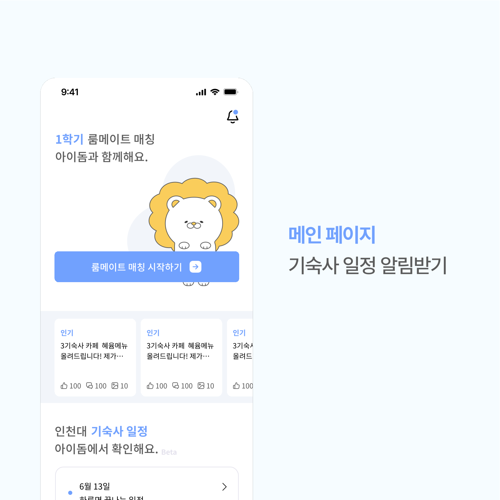
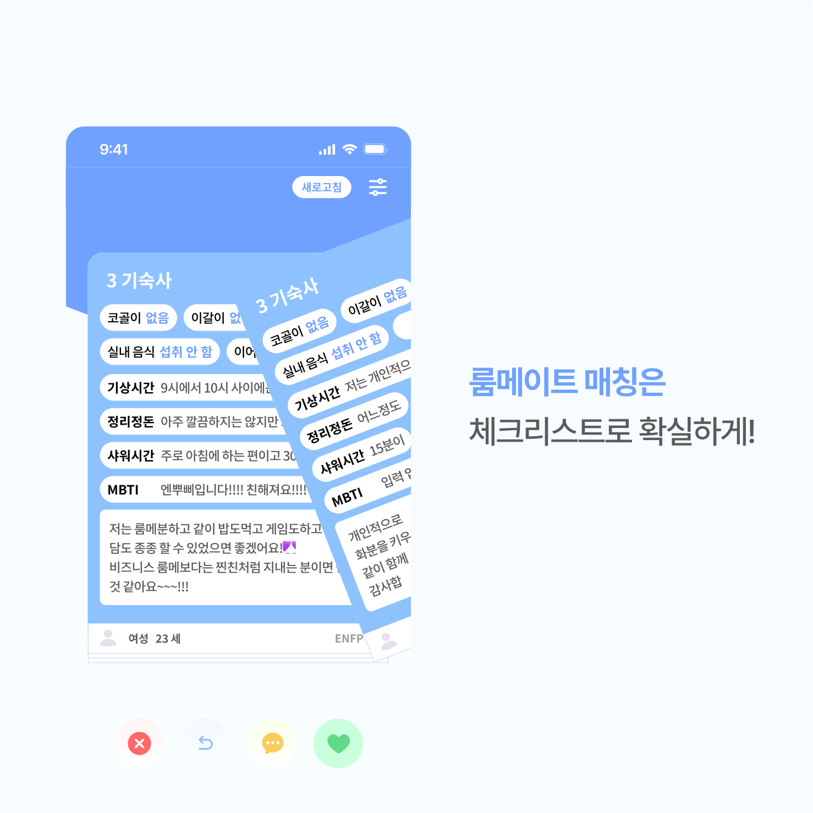
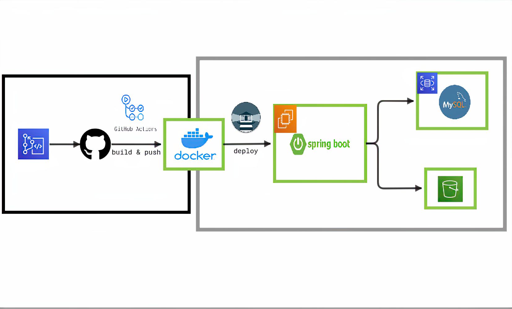

<br>
<div align="center">
    
    <h1>아이돔</h1>
    <h3>인천대학교 기숙사생들을 위한 모든 것</h3>
    <strong>
        크롤링 기반 기숙사 공식 일정 알림&nbsp;&nbsp;&nbsp;&nbsp;|&nbsp;&nbsp;&nbsp;&nbsp;
        룸메이트와 공유 캘린더&nbsp;&nbsp;&nbsp;&nbsp;|&nbsp;&nbsp;&nbsp;&nbsp;
        룸메이트 매칭&nbsp;&nbsp;&nbsp;&nbsp;|&nbsp;&nbsp;&nbsp;&nbsp;
        기숙사 커뮤니티
    </strong>
    <h3>
        <a href="https://play.google.com/store/apps/details?id=org.appcenter.inudorm&hl=ko">📲 playstore 다운링크</a>
        &nbsp<a>|</a>&nbsp
        <a href="https://apps.apple.com/kr/app/아이돔/id1660001335">📲 appstore 다운링크 </a>
    </h3>
</div><br>

---

## 서비스 UI

<div align="center" style="display:flex;">
    
    
    
    
    
</div>

---

## CI/CD baseline architecture

<div align="center">
    
</div>

---

## Database Schema Diagram
<div align="center">

</div>

---

## API 엔드포인트 목록

[](http://ec2-43-200-211-165.ap-northeast-2.compute.amazonaws.com:8080/swagger-ui/index.html) 에서 테스트 하실 수 있습니다. 

본 저장소 [github wiki](https://github.com/idorm/idorm-server/wiki/Api-Description)에 구현한 API 목록이 정리되어 있습니다.

---

## Dependencies

``` java
dependencies {
    // spring web
    implementation 'org.springframework.boot:spring-boot-starter-web'

    // spring data jpa
    implementation 'org.springframework.boot:spring-boot-starter-data-jpa'

    // spring database
    implementation 'org.springframework.boot:spring-boot-starter-data-jdbc'
    implementation 'org.springframework.boot:spring-boot-starter-jdbc'

    // spring validation
    implementation 'org.springframework.boot:spring-boot-starter-validation'

    // spring mail
    implementation 'org.springframework.boot:spring-boot-starter-mail'

    // spring security
    implementation 'org.springframework.boot:spring-boot-starter-security'

    // spring aop
    implementation 'org.springframework.boot:spring-boot-starter-aop'

    // sentry
    implementation 'io.sentry:sentry-spring-boot-starter:6.2.1'

    // crawling
    implementation 'org.jsoup:jsoup:1.15.3'

    // swagger ui
    implementation 'org.springdoc:springdoc-openapi-ui:1.7.0'

    // aws s3
    implementation 'com.amazonaws:aws-java-sdk-s3'
    implementation platform('com.amazonaws:aws-java-sdk-bom:1.11.1000')

    // fcm
    implementation 'com.google.firebase:firebase-admin:9.1.1'

    // jwt
    implementation group: 'io.jsonwebtoken', name: 'jjwt', version: '0.2'

    // lombok
    annotationProcessor 'org.projectlombok:lombok'
    compileOnly 'org.projectlombok:lombok'

    // mysql
    runtimeOnly 'mysql:mysql-connector-java'

    // database migration
    implementation 'org.flywaydb:flyway-core:8.4.4'
    implementation 'org.flywaydb:flyway-mysql:8.4.4'

    // monitoring
    implementation 'org.springframework.boot:spring-boot-starter-actuator'
    runtimeOnly 'io.micrometer:micrometer-registry-prometheus'

    // spring test
    testImplementation 'org.springframework.boot:spring-boot-starter-test'
}
```

---